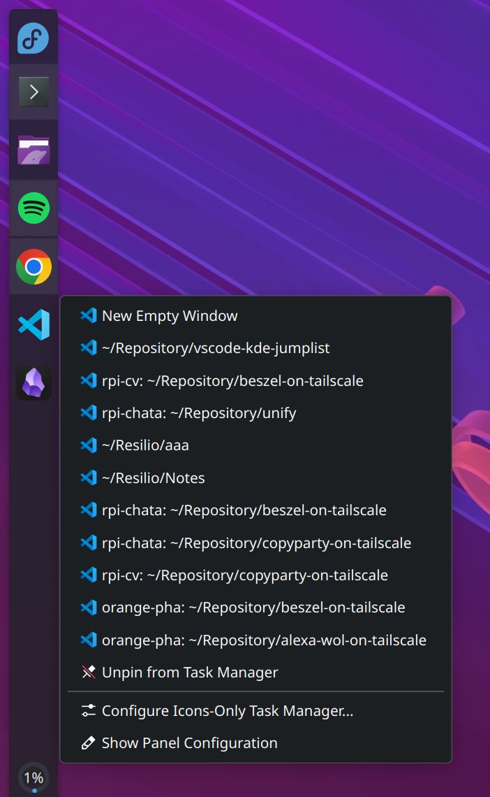

# vscode-kde-jumplist

Adds a KDE Plasma taskbar jump list to VSCode showing your recently opened workspaces and SSH remotes.

## Why

KDE's taskbar jump list (right-click on a pinned icon) shows recent documents for apps that report to KDE's [KActivities](https://develop.kde.org/docs/plasma/kactivities/) framework. VSCode is an Electron app and doesn't integrate with KActivities — so the jump list stays empty.

This tool works around that by reading VSCode's own internal workspace history (`~/.config/Code/User/globalStorage/storage.json`) and generating a local `.desktop` file override with your recent workspaces as static [Desktop Actions](https://specifications.freedesktop.org/desktop-entry-spec/latest/ar01s11.html). It handles local folders and SSH remotes.



## Requirements

- KDE Plasma 5 or 6
- VSCode installed via package manager (`/usr/share/applications/code.desktop` or `/usr/local/share/applications/code.desktop`)
- Python 3.9+

## Install

```bash
git clone https://github.com/youruser/vscode-kde-jumplist
cd vscode-kde-jumplist
./install.sh
```

This copies the script to `~/.local/bin/`, installs a systemd user timer that refreshes the jump list every 60 seconds, and runs it once immediately. Run intervals can be adjusted in `~/.config/systemd/user/vscode-jumplist.timer`.

## Uninstall

```bash
./uninstall.sh
```

Removes all installed files and restores the default VSCode desktop entry.

## How it works

1. Reads `profileAssociations.workspaces` from VSCode's `storage.json` — this contains every workspace you've ever opened, including SSH remotes (`vscode-remote://ssh-remote+host/path`).
2. Determines recency by checking the mtime of each workspace's storage directory under `~/.config/Code/User/workspaceStorage/` (VSCode stores a per-workspace SQLite db there, keyed by an MD5 hash of the workspace URI).
3. Writes `~/.local/share/applications/code.desktop` — a local override that shadows the system desktop file and adds the recent workspaces as `[Desktop Action]` entries. KDE's task manager picks these up immediately.

## Files

| File | Installed to |
|---|---|
| `update-vscode-jumplist.py` | `~/.local/bin/` |
| `vscode-jumplist.service` | `~/.config/systemd/user/` |
| `vscode-jumplist.timer` | `~/.config/systemd/user/` |
